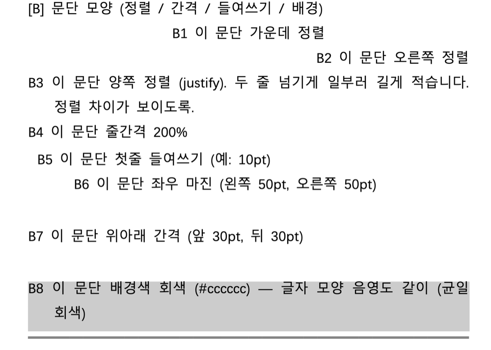

# hancomdocs-capture

한컴독스(Hancom Docs) 웹 뷰어(webhwp)에 `.hwp` / `.hwpx`(및 기타 오피스 파일)를 **자동 업로드**하고,
렌더된 페이지를 **이미지로 캡처 / 확대 / 텍스트로 찾아 캡처**하는 Claude Code 스킬.

- **Playwright headless** — 보이는 창 없음, 물리 마우스/키보드 안 건드림, 백그라운드 가능
- **로그인 1회** — 비밀번호 저장 없이 세션(`auth.json`)만 재사용
- **A4 페이지만 깔끔히** — 툴바·여백 없이, 페이지 잘림 없이, 방향(세로/가로) 자동 인식
- **열 수 없는 파일 감지** — 손상/형식오류는 `cannot_open` 상태로 보고

> hwp **내용 읽기/편집**이 목적이면 [claw-hwp](https://github.com/DoHyun468/claw-hwp) 스킬을 쓰세요. 이 스킬은 "**한컴독스에서 어떻게 보이는지**"를 캡처하는 용도입니다.

## 데모 — 영역 확대(zoom)

전체 페이지에서 원하는 영역을 골라(왼쪽) 고해상도로 잘라냅니다(오른쪽).

| `capture --grid` 로 좌표 잡기 | `zoom --clip` 결과 |
|---|---|
|  |  |

> 30쪽짜리 문서의 29쪽에서 `[B] 문단 모양` 섹션(B1~B8)만 `zoom --clip "35,300,715,510" --scale 3` 으로 추출.

## 설치 (환경마다 1회)

```bash
# 1) 스킬을 Claude Code 스킬 폴더로
git clone <this-repo> ~/.claude/skills/hancomdocs-capture

# 2) 의존성
cd ~/.claude/skills/hancomdocs-capture/scripts
npm install
npx playwright install chromium     # Chromium 다운로드 (~수백 MB)

# 3) 로그인 (브라우저 창에서 한컴독스 로그인 → auth.json 자동 저장)
node login.js
```

> **OS 무관 (Windows·macOS·Linux 동일)**: `node`만 깔려 있으면 같은 코드로 동작한다. Windows에서는 PowerShell로 위 명령을 **한 줄씩** 실행(`&&` 체이닝은 PowerShell에서 안 됨). 파일 경로는 그 OS 방식대로 — Windows는 `--file C:\path\report.hwp`, mac/Linux는 `--file /abs/report.hwp`.

스킬로 쓸 때는 위 과정을 SKILL.md가 **자동 점검·안내**합니다 — 사용자는 "이 hwp 한컴독스에 올려서 보여줘"라고만 하면 됩니다.

## 사용

```bash
cd scripts

# 첫 페이지(또는 N쪽) A4 한 장 깔끔히 캡처
node hancom.js capture --file /abs/report.hwp --page 1

# 좌표 격자를 얹어서 (확대할 영역 좌표 읽기용)
node hancom.js capture --file /abs/report.hwp --page 9 --grid

# 페이지 안의 특정 영역 확대 (페이지 왼쪽위=0,0 기준 CSS px)
node hancom.js zoom --name report.hwp --page 9 --clip "60,420,670,260" --scale 3

# 텍스트를 찾아 그 페이지 캡처
node hancom.js around --name report.hwp --text "지원대상"
```

결과는 마지막 줄 `RESULT_JSON={...}`. 자세한 명령 명세는 [`ORDER_SPEC.txt`](ORDER_SPEC.txt).

## 좌표 흐름 (캔버스 렌더라 텍스트 위치 자동탐색 불가)

1. `capture --grid` 로 격자 입힌 페이지를 받고 →
2. 원하는 영역의 `x, y, width, height`를 눈으로 읽어 →
3. `zoom --clip "x,y,w,h"` 로 확대.

## 열 수 없는 파일

```json
{ "status": "cannot_open", "docName": "broken.hwp",
  "reason": "webhwp가 파일을 열 수 없습니다(손상/형식 오류). hwp·hwpx 동일 에러." }
```
(한계: 절단/부분손상 일부는 에러 없이 깨진 바이트가 렌더되는 '조용한 가비지' 모드가 있어 미감지.)

## 보안

- **비밀번호는 저장하지 않습니다.** 로그인 세션 토큰만 `auth.json`에 저장됩니다.
- `auth.json`은 현재 로그인 세션 그 자체라 민감 → `.gitignore`로 커밋 차단됨. 유출 주의, 만료 시 `node login.js` 재실행.

## 문서

- [`SKILL.md`](SKILL.md) — Claude Code 스킬 정의 (트리거 · 온보딩 · 명령)
- [`ORDER_SPEC.txt`](ORDER_SPEC.txt) — 에이전트 주문(명령) 명세
- [`DEBUG_NOTES.md`](DEBUG_NOTES.md) — 개발 노트 (접근법, webhwp 내부 발견, 안전 교훈, 실패 모드)

## 라이선스

MIT
